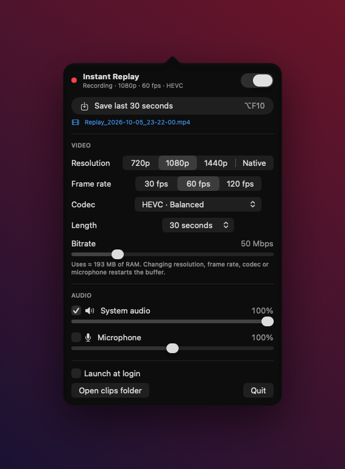

<div align="center">

# Instant Replay for macOS

**ShadowPlay-style instant replay for the Mac.**
Instant Replay keeps the last few seconds or minutes of your screen in memory. Press <kbd>⌥ Option</kbd> + <kbd>F10</kbd> to save that moment as a clip.



</div>

---

If you've used NVIDIA's <kbd>Alt</kbd>+<kbd>F10</kbd> on Windows, you know how it works: it records all the time and only saves when something worth keeping happens. macOS doesn't come with anything like this. Instant Replay fills that gap. It's a small native menu bar app built on ScreenCaptureKit and VideoToolbox, uses hardware encoding, and has no Dock icon or windows.

## Features

- **Always-on replay buffer.** Choose how much to keep: 15 s, 30 s, 1 min, 2 min or 5 min. Encoded frames are held in RAM, so nothing is written to disk until you save.
- **Instant save.** <kbd>⌥</kbd> + <kbd>F10</kbd> by default, rebindable from the panel. It's a global hotkey that also works inside fullscreen games. Video is written without re-encoding, so a 30-second clip saves in well under a second.
- **Records everything on screen.** It captures the full display, so games, fullscreen Spaces, every window and the cursor all end up in the clip.
- **Codecs, ordered from fastest to highest quality:**

  | Codec | Tier | Container | Notes |
  |---|---|---|---|
  | H.264 High | Fastest | `.mp4` | Plays everywhere. Limited to 4096×2304. |
  | HEVC Main | Balanced | `.mp4` | About half the size of H.264 at the same quality. |
  | HEVC Main 10 | High Quality | `.mp4` | 10-bit, so far less banding in gradients and dark scenes. |
  | ProRes 422 | Best Quality | `.mov` | Intra-frame and visually lossless, meant for editing. Uses a lot of RAM. |

- **Resolution:** 720p, 1080p, 1440p or native, scaled to match your display's aspect ratio.
- **Frame rate:** 30, 60 or 120 fps. 120 fps needs a ProMotion or 120 Hz display.
- **Bitrate:** 10–200 Mbps. Changes apply immediately without resetting the buffer.
- **Audio:**
  - System audio and microphone, each with its own on/off switch and volume (mic can go up to 200%).
  - Volume is applied when you save, so it also changes audio that's already in the buffer.
- **Stays on:**
  - Starts at login through a launch agent, and launchd relaunches it if it crashes.
  - Restarts capture after sleep/wake, screen unlock, user switching and display changes.
  - Opts out of App Nap while recording.
  - Remembers whether you left recording on or off.

## Install

You need macOS 15 or later on Apple silicon, plus the Xcode Command Line Tools (`xcode-select --install`).

```bash
git clone https://github.com/revo667/InstantReplay.git
cd InstantReplay
./build.sh install
```

`build.sh` builds a release binary with SwiftPM, packages it into `InstantReplay.app`, signs it ad-hoc, copies it to `/Applications` and launches it. Run `./build.sh` with no arguments if you only want the bundle in `build/`.

On first launch, macOS asks for **Screen & System Audio Recording** permission. Grant it in *System Settings → Privacy & Security* and relaunch the app. If you turn on the microphone, you'll get a microphone prompt too.

## Usage

| Action | How |
|---|---|
| Save a replay | <kbd>⌥</kbd> + <kbd>F10</kbd>, or **Save last …** in the panel |
| Change the hotkey | Click the shortcut next to **Save shortcut**, press the new combo (<kbd>Esc</kbd> cancels, ↺ resets) |
| Settings | Click the ⏺ icon in the menu bar |
| Find clips | `~/Movies/InstantReplay/Replay_YYYY-MM-DD_HH-MM-SS.mp4` |

When a save succeeds you'll hear the *Glass* sound; if it fails you'll hear *Basso*.

> **Tip:** On Mac keyboards, F10 is the mute key by default. Either press <kbd>fn</kbd> + <kbd>⌥</kbd> + <kbd>F10</kbd>, or turn on *Use F1, F2, etc. keys as standard function keys* in Keyboard settings.

## How it works

```
ScreenCaptureKit ──► VideoToolbox encoder ──► ReplayBuffer (RAM, GOP-aligned ring)
   │ system audio / mic                              │
   └──────────────► deep-copied PCM ─────────────────┤
                                                     ▼  ⌥F10
                                    ClipWriter (AVAssetWriter, video passthrough, AAC)
```

| File | Responsibility |
|---|---|
| `CaptureEngine.swift` | Configures the `SCStream`: display, size, pixel format, audio and microphone |
| `VideoEncoder.swift` | `VTCompressionSession` per codec, with a forced keyframe every second and bitrate changes applied live |
| `ReplayBuffer.swift` | Thread-safe ring buffer that drops whole GOPs so a clip always starts on a keyframe |
| `ClipWriter.swift` | Writes video without re-encoding, applies per-track gain with vDSP, and encodes audio to AAC |
| `ReplayController.swift` | Holds state, settings and the watchdog, and handles sleep/wake and the login agent |
| `MenuView.swift` | The SwiftUI menu bar panel |
| `HotKey.swift` | Global hotkey via Carbon `RegisterEventHotKey`, so it doesn't need Accessibility permission |
| `Shortcut.swift` | User-configurable shortcut: capture from key events, layout-aware labels, persistence |

## Memory usage

The buffer stays in RAM, so memory use is roughly `bitrate × length / 8`:

| Setting | 30 s | 5 min |
|---|---|---|
| HEVC 50 Mbps | ~190 MB | ~1.9 GB |
| ProRes 422 1080p60 | ~1.1 GB | not recommended |

The panel shows a live estimate for whatever you've currently selected.

## Known limitations

- Only the main display is captured.
- With the microphone on, it's saved as a **second audio track**. QuickTime plays both tracks, but some players only play the first.
- Because the app is signed ad-hoc, rebuilding it can reset the Screen Recording permission. Sign with your own identity to avoid that: `SIGN_IDENTITY="Apple Development: …" ./build.sh install`.
- macOS periodically asks whether screen recording apps should keep their access. Approve it when the prompt appears.
